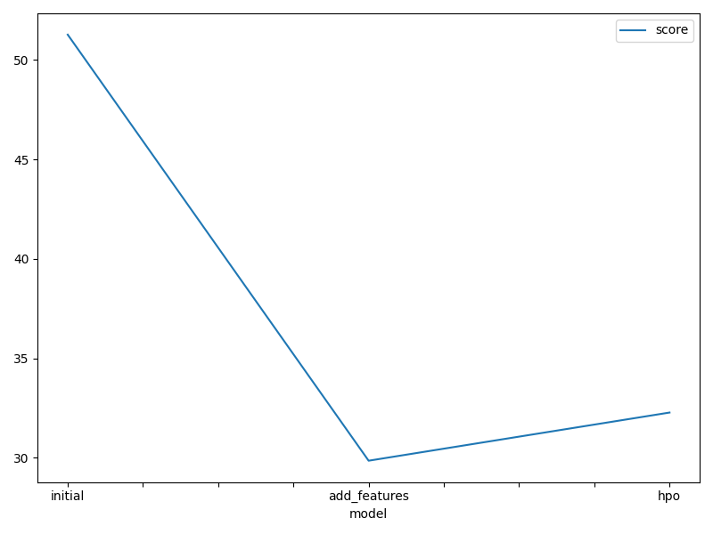
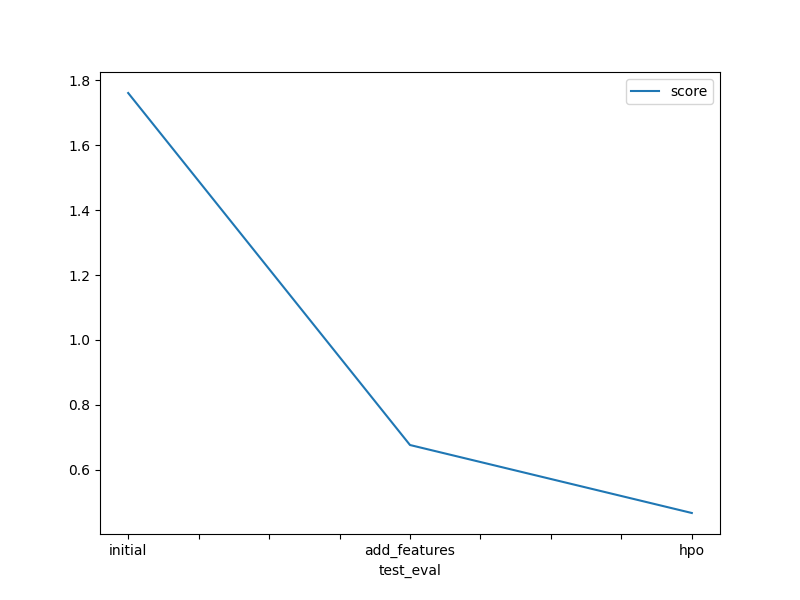

# Report: Predict Bike Sharing Demand with AutoGluon Solution
#### Kaung Myat Htet

## Initial Training
### What did you realize when you tried to submit your predictions? What changes were needed to the output of the predictor to submit your results?
I noticed that Kaggle will reject your submission if the predictions values are less than 0 or negative values so we have to set the values that are less than 0 to be 0 using `predictions.clip(lower=0)`.

### What was the top ranked model that performed?
The top ranked model that performed is the model with new features along with hyperparameters finetuning.

## Exploratory data analysis and feature creation
### What did the exploratory analysis find and how did you add additional features?
The exploratory data analysis (EDA) revealed clear temporal patterns in bike rental demand. Specifically, demand varied significantly by hour of the day, day of the week, and season. For example, there were noticeable spikes in rentals around 9AM and 5PM, which align with typical commute hours, and lower activity during late-night hours. I add the `hour`, `day`, `month` features from `datetime` field.

### How much better did your model preform after adding additional features and why do you think that is?
Baseline model got RMSE score of 1.7617 and the new model with addition features got 0.67577, showing an improvement of 1.08593. I believed this improvement is largely due to the new `hour` feature. The `hour` feature captures daily patterns in bike demand, which tend to follow predictable trends. For example, there is typically a spike in bike rentals around 9 AM, likely due to morning commutes. By including hour, the model was able to better learn these temporal patterns, which significantly improved its predictive accuracy.

## Hyper parameter tuning
### How much better did your model preform after trying different hyper parameters?
My model saw an increase of 0.20965 RMSE score after trying different hyper parameters since RMSE score of new feature is 0.67577 and that of hyperparameter tuning is 0.46612. 

### If you were given more time with this dataset, where do you think you would spend more time?
If I were given more time with this dataset, I would like to try deep learning approaches such as LSTM or RNN. Since this dataset is a time series probelm with hourly bike usage data, I think these type of models could better capture temporal dependencies and sequential pattern. However, these methods come with higher computational cost.

### Create a table with the models you ran, the hyperparameters modified, and the kaggle score.
|model|hpo1|hpo2|hpo3|score|
|--|--|--|--|--|
|initial|presets=best_quality|time_limit=600|?|1.7617|
|add_features|presets=best_quality|time_limit=600|?|0.67577|
|hpo|num_trials=10|scheduler=local|searcher=auto|0.46612|

### Create a line plot showing the top model score for the three (or more) training runs during the project.

### Create a line plot showing the top kaggle score for the three (or more) prediction submissions during the project.

## Summary

In this project, I used __AutoGluon__ to predict bike sharing demand based on historical usage and weather data. Starting with a baseline model, I did EDA to gain insights about the data and add additonal features named `hour`, `day` and `month` to improve the model performance and then do hyperparameter tuning. I achieved the best RMSE score of `0.46612`.